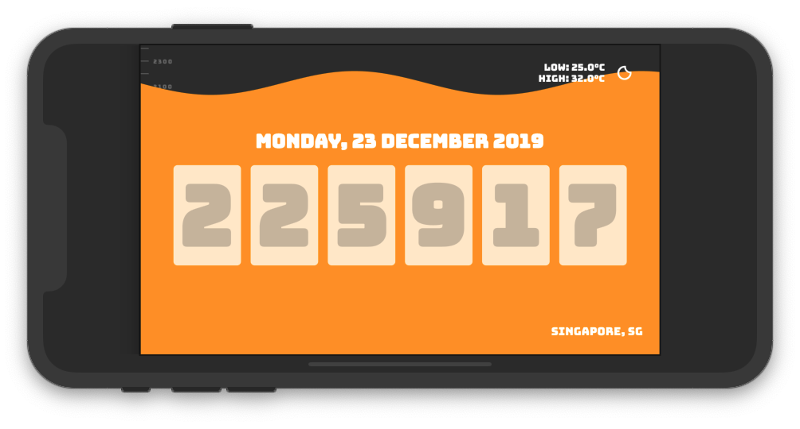
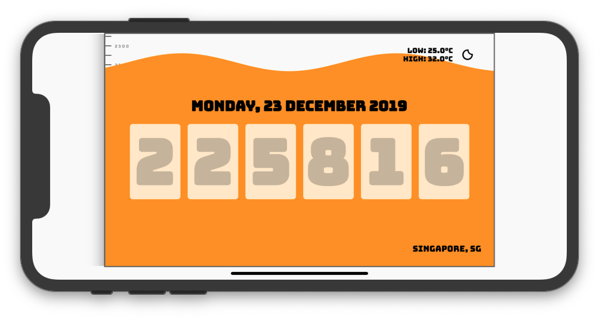
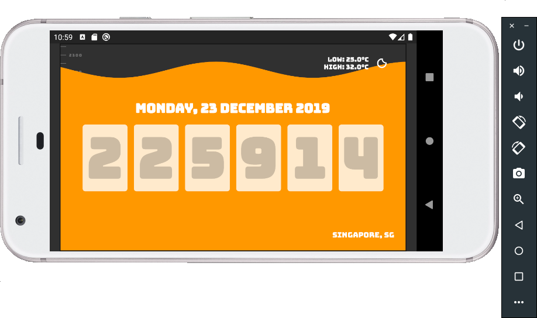
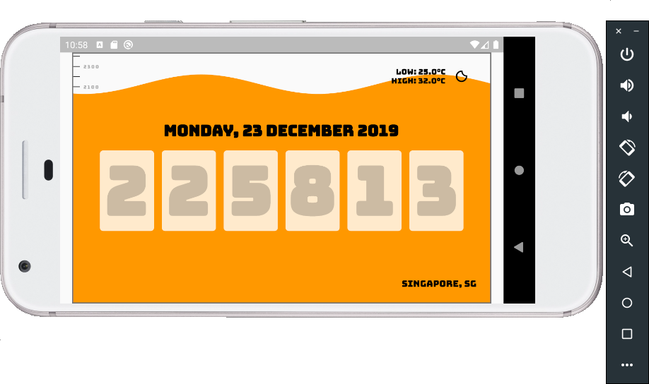
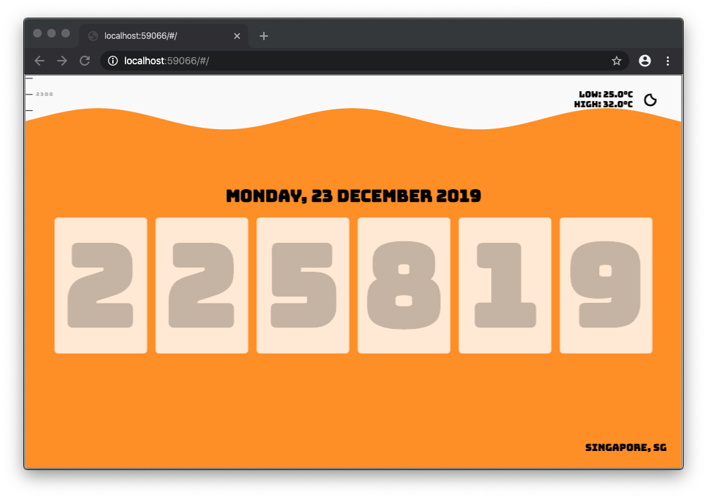

## Wave Clock

Flutter iOS



Flutter Android



Flutter Web



Wave Clock is a [Flutter](https://flutter.dev) clock for [Lenovo Smart Display](https://www.lenovo.com/us/en/smart-display)
device built-in with [Google Assistant](https://assistant.google.com/) for the [Flutter Clock Challenge](https://flutter.dev/clock).

The clock uses [ClockCustomizer] and [ClockModel] which are provided by [Flutter](https://flutter.dev) team to get the following simulated data:
- Current Location
- Low and High Temperatures
- Light and Dark Themes
- 12-Hour and 24-Hour Format
- Weather Conditions: Cloudy, Foggy, Rainy, Snowy, Sunny, Thunderstorm and Windy
- Units: Celsius and Fahrenheit

The clock uses the animated wave as a visual indicator to show the current hour of the day with the help of the clock marker.
At the bottom, it started off as 0000 hours or 1AM. At the top, it ended off as 2400 hours or 12AM.

At the start of every hour, the animated wave will increase its height and move up to the next hour slot.
When the current time resets to 0000 hours, the animated wave will reset to the bottom.

The color of the animated wave will change according to the weather condition and the time of the day.
If the current time is night and the weather condition is cloudy,
the clock will show night cloudy icon and the color will change to dark blue color.

The clock can show the current time in 12-hour or 24-hour format and show the temperatures in celsius and fahrenheit.
The clock has two theme modes - light theme and dark theme. The text and icon in the clock will change according to the selected theme.

The user interface design of the Wave Clock consists of:
- [WaveClockApp](https://github.com/grandnexus/wave_clock/blob/master/wave_clock/lib/main.dart): The root of the application.
- [Clock](https://github.com/grandnexus/wave_clock/blob/master/wave_clock/lib/clock.dart): The main clock widget which holds all the related widgets.
- [DigitColumn](https://github.com/grandnexus/wave_clock/blob/master/wave_clock/lib/digit_column.dart): The widget to represent a single digit integer.
- [ClockMarker](https://github.com/grandnexus/wave_clock/blob/master/wave_clock/lib/clock_marker.dart): The widget is the hourly time marker (i.e. 1300 hrs and 1PM) to show the current wave level.
- [Wave](https://github.com/grandnexus/wave_clock/blob/master/wave_clock/lib/wave.dart): The widget is the animated wave to indicate the current hour of the day and weather condition using color.
- [WaveClipper](https://github.com/grandnexus/wave_clock/blob/master/wave_clock/lib/wave.dart): The custom clipper to create wave animation.
- [ClockCustomizer](https://github.com/grandnexus/flutter_clock_helper/blob/master/flutter_clock_helper/lib/customizer.dart): The widget is provided by [Flutter](https://flutter.dev) team to provide simulated data from the [Lenovo Smart Display](https://www.lenovo.com/us/en/smart-display).

The model classes of the Wave Clock consists of:
- [WaveTime](https://github.com/grandnexus/wave_clock/blob/master/wave_clock/lib/wave_time.dart): The model class to provide formatted current time in right digits and formats.
- [Weather](https://github.com/grandnexus/wave_clock/blob/master/wave_clock/lib/weather.dart): The model class to hold the icon, text and wave colors for the clock.
- [ClockModel](https://github.com/grandnexus/flutter_clock_helper/blob/master/flutter_clock_helper/lib/model.dart): The model class to hold the simulated data from [Lenovo Smart Display](https://www.lenovo.com/us/en/smart-display).

The utility classes of the Wave Clock consists of:
- [Utils](https://github.com/grandnexus/wave_clock/blob/master/wave_clock/lib/utils.dart): The utility class to get the required data based on the respective user interface and datetime logic.

The widget and unit testing [test cases](https://github.com/grandnexus/wave_clock/blob/master/wave_clock/test) of the Wave Clock are created.

Wave Clock is working well in Flutter iOS, Android and Chrome Browser.

## Project Dependencies
- [intl](https://pub.dev/packages/intl): This package is used for Date formatting.
- [weather_icons](https://pub.dev/packages/weather_icons): This package is used for display weather icons based on simulated weather conditions.
- [flutter_clock_helper](https://github.com/grandnexus/flutter_clock_helper/blob/master/flutter_clock_helper): This package is used for customizing the clock based on simulated data.
- [Bungee](https://fonts.google.com/specimen/Bungee): This font is release under Google SIL Open Font License and used for display all the texts in the clock.

## How To Use

Go to wave_clock folder, type in the Terminal:

```bash
flutter create . && flutter pub get && flutter run
```
